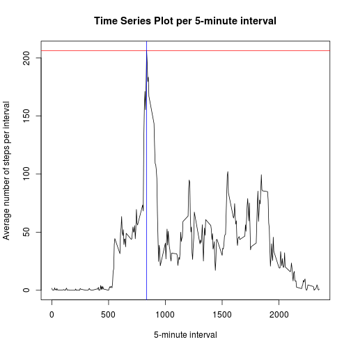
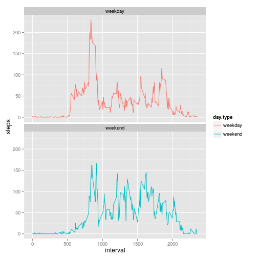

## Loading and preprocessing the data

Read in the data:

```r
if(!file.exists('activity.csv')){
    unzip('activity.zip')
}
activity <- read.csv('activity.csv')
```

Convert date to column with date type:

```r
activity$date <- as.Date(activity$date, format = "%Y-%m-%d")
```


## What is mean total number of steps taken per day?

First, calculate total steps:

```r
total.steps <- tapply(activity$steps, activity$date, sum)
```

Calculate the mean and median for the total steps per day:

```r
mean <- mean(total.steps, na.rm = TRUE)
median <- median(total.steps, na.rm = TRUE)
```
Hence the mean and median for the total steps per day:
Mean is 10766.1886792 
and Median is 10765

Draw the distribution of total number of steps per day with a histogram:

```r
hist(total.steps, xlab="Total number of steps per day", main = "Histogram of the total number of steps taken each day")
abline(v=mean, col = c("red"))
abline(v=median, col = c("blue"), lty = 2)
```

 

## What is the average daily activity pattern?


```r
library (plyr)
spi <- ddply(activity, .(interval), summarize, steps = mean(steps, na.rm=TRUE))
max.spi <- max(spi$steps)
max.interval <- spi[spi$steps==max(max.spi),1]
```

Plot of the average number of steps taken each interval:

```r
plot(spi$interval,spi$steps, ylab="Average number of steps per interval",xlab="5-minute interval", main="Time Series Plot per 5-minute interval", type="l")
abline(h=max.spi, col = c("red"))
abline(v=max.interval, col = c("blue"))
```

 

The maximum number of steps per interval in average is 
206.1698113
and corresponds to the interval is
835

## Imputing missing values

Calculate the total number of missing values:

```r
missingV <- sum(is.na(activity$steps))
```
So the total number of missing values in  the dataset is 2304

To fill in the missing values, I'll use mean steps for interval for the entire dataset:

```r
#copy the activity set to create a new dataset
activitycopy <- activity
row.names(spi)<- spi$interval
ind <- which(is.na(activitycopy$steps))
activitycopy[ind,1] <- spi[as.factor(activitycopy[ind,3]),2]
```

First, calculate total steps with new dataset:

```r
nwtotal.steps <- tapply(activitycopy$steps, activitycopy$date, sum)
```

Calculate the mean and median for the new total steps per day:

```r
nwmean <- mean(nwtotal.steps, na.rm = TRUE)
nwmedian <- median(nwtotal.steps, na.rm = TRUE)
```

Hence the new mean and median for the total steps per day:
New mean is 10766.1886792 
and new median is 10766.1886792

Draw the distribution of total number of steps per day with a new histogram:

```r
hist(nwtotal.steps, xlab="Total number of steps per day", main = "Histogram of the total number of steps taken each day")
abline(v=nwmean, col = c("red"))
abline(v=nwmedian, col = c("blue"), lty = 2)
```

 

The mean of the first part and the mean of the second part is equal. The median
of the fist part is slightly lower than the median of the second part.


```r
t1 = table(activity$date, is.na(activity$steps))
```

Exploring the NAs we find that there are 8 days full of NA steps before filling the missing data. Same is 0 for imputed data.

## Are there differences in activity patterns between weekdays and weekends?

Add a factor column for whether a day is a weekday or weekend.

```r
day.type <- function(date) {
    if (weekdays(date) %in% c('Saturday', 'Sunday')) {
        return('weekend')
    } else {
        return('weekday')
    }
}

day.types <- sapply(activitycopy$date, day.type)
activitycopy$day.type <- as.factor(day.types)

spiw <- ddply(activitycopy, .(interval,day.type), summarize, steps = mean(steps, na.rm=TRUE))
max.spiw <- max(spiw$steps)
max.intw <- spiw[spiw$steps==max(max.spiw),1]
```

Plot of the average number of steps taken each interval during weekends and weekdays:

```r
library (ggplot2)
ggplot(data=spiw, aes(x=interval, y=steps, group=day.type)) + geom_line(aes(color=day.type))+ facet_wrap(~ day.type, nrow=2)
```

 

